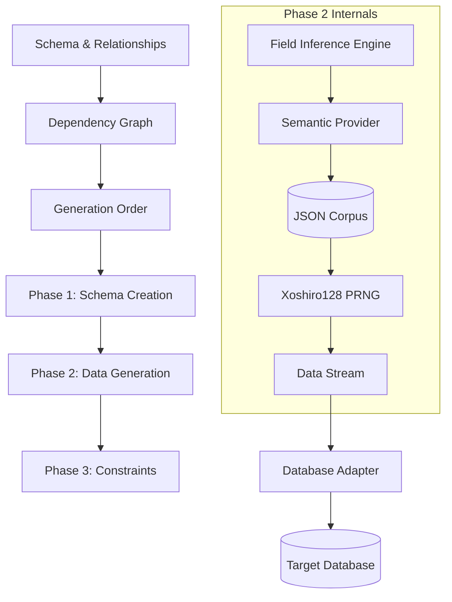

# Core Engine Architecture

The Drawline Core engine is designed for high-performance, relationship-aware synthetic data generation. It bridges the gap between simple random data and production-quality datasets by using a sophisticated multi-stage generation process.

## Architectural Overview

At its heart, Drawline Core is a **state machine** that orchestrates the flow of metadata from a schema definition to a fully populated database.

## Core Components

### 1. Dependency Graph (Topological Resolver)
Before a single record is created, the engine builds a directed graph of your database. It identifies "Parent" tables (those with no foreign keys) and "Child" tables. It then calculates a **Topological Sort** to determine the exact order of execution.
> [!TIP]
> This ensures that when a `Post` is created, its `Author` already exists in the database.

### 2. Field Inference Engine
The "Brain" of the system. It doesn't require you to tell it that `first_name` should be a name. It uses a scoring algorithm to tokenize field names and match them against known semantic patterns.

### 3. Semantic Provider
The "Library" of Drawline. It contains curated datasets for dozens of industries. It uses a **Lazy Loading** strategy to keep memory usage low, only loading the "Indian Names" or "Medical Specialties" JSON files when they are actually needed.

### 4. Database Adapters
Drawline is database-agnostic. The core engine produces generic "documents", and the Adapters translate these into:
- **SQL INSERTs** (Postgres, MySQL, SQLite, SQL Server)
- **JSON Documents** (MongoDB, Firestore)
- **Key-Value Pairs** (Redis)
- **CSV/Excel** (Exports)

## Design Philosophies

- **No Placeholders**: We never generate `Lorem Ipsum`. We generate content that makes sense for the field.
- **Stateless Generation**: The engine doesn't need to "read" the database to know what IDs to use for foreign keys. It calculates them deterministically.
- **Streaming First**: We use `async generators` and batch processing to handle millions of records without overflowing the Node.js heap.
